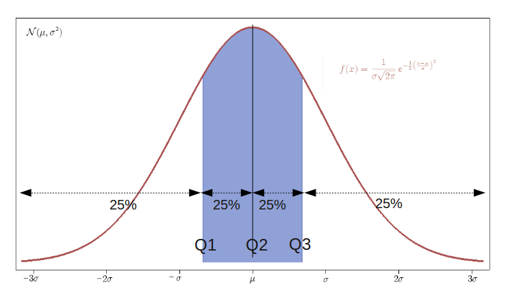

```{r library list, echo = FALSE}
library(ggplot2)
library(knitr)
library(rgl)
knit_hooks$set(webgl = hook_webgl)
```

## Lesson plan

Today we will:

- Finish covering derivatives, partial derivatives, gradient and Hessian
- Cover basics of probability
- Cover basics of statistics

## Minimum and maximum

When $f'(x) = 0$, $f(x)$ is a critical point:

- if $f''(x) > 0$ then $f(x)$ is a local minimum of $f$
- if $f''(x) < 0$ then $f(x)$ is a local maximum of $f$


## Derivatives in R

```{r}
D(expression(cos(x)), "x")
D(expression(x^2), "x")
D(D(expression(x^3), "x"), "x")
```

## Derivatives in R (2)

The function `deriv` helps construct a function that will return both $f(x)$ and $f'(x)$:

```{r}
cos_deriv <- deriv(expression(cos(x)), "x", function.arg = TRUE)
cos_deriv(1:5)
```

## Derivatives in R (3)

```{r, fig.align = "center", out.width = "50%"}
cd <- data.frame(x = seq(0, 10, by = 0.01), 
                 cos = as.numeric(cos_deriv(seq(0, 10, by = 0.01))), 
                 cos_prime = as.numeric(attr(cos_deriv(seq(0, 10, by = 0.01)),
                                             "gradient")))
ggplot(data = cd, aes(x = x)) + 
       geom_line(aes(y = cos), color="#FF3489") + geom_line(aes(y = cos_prime),
                                                            color="#FF7645")
```

## Derivatives in R (4): a better graph

```{r, fig.align = "center", out.width = "60%"}
library(reshape2)
cd2 <- melt(cd, id.vars = "x")
ggplot(data = cd2, aes(x = x, y = value, linetype = variable)) + 
       geom_line(size = 2, colour="#FF1789")
```


## Multivariate functions 

```{r, out.width = '60%', fig.retina = NULL, fig.align = "center"}
x <- 0:10; y <- 0:10
x_seq <- seq(min(x), max(x), length.out = 40)
y_seq <- seq(min(y), max(y), length.out = 40)
fx <- outer(x_seq, y_seq, function(x, y){sin(x) * y + 3})
persp(x = x_seq, y = y_seq, z = fx, theta = -30, phi = 30, 
      xlab = "x", ylab = "y", zlab = "f(x)", col = "blue", expand = 0.8)
```

## RGL

```{r, webgl = TRUE, fig.align = "center"}
library(rgl)
persp3d(x = x_seq, y = y_seq, z = fx)
```


## Partial derivative

For multivariate function, such as $f(x, y)$, a partial derivative is the derivative of this function with respect to one variable, with others held constant. It is usually noted $f'_x(x, y)$ (another common notation is $\frac{\partial f}{\partial x}$).

```{r, echo = FALSE, out.width = '50%', fig.retina = NULL, fig.align = 'center'}
knitr::include_graphics("./img/Partial_func_eg.png")
```

## Properties of partial derivative

- One can define the second partial derivative of $f$, noted $\frac{\partial^2}{\partial x_i \partial x_j} f$
- Schwarz' theorem: $\frac{\partial^2}{\partial x_i \partial x_j} f = \frac{\partial^2}{\partial x_j \partial x_i} f$ if the second derivatives are continuous


## Gradient

The gradient of a multivariate function $f: \mathbb{R}^n \mapsto \mathbb{R}$  is noted $\nabla f$ and defined as the vector of partial derivatives of $f$:

$$
\nabla f(a) = \begin{bmatrix} \frac{\partial}{\partial x_1} f(a)\\
                     \vdots\\
                     \frac{\partial}{\partial x_n} f(a)
              \end{bmatrix}
$$

$\nabla f$ points in  the direction of the greatest rate of increase of $f$

The magnitude of $\nabla f$ is the slope of the graph in that direction

## Hessian

The Hessian (or Hessian matrix) is a square matrix of the partial second derivatives of a function.

$$
H(a) = \begin{bmatrix}
              \frac{\partial^2}{\partial^2 x_{1}} f(a) & \frac{\partial^2}{\partial x_1\partial x_2} & \cdots & \frac{\partial^2}{\partial x_1\partial x_n}\\
              \frac{\partial^2}{\partial x_2\partial x_1} f(a) & \frac{\partial^2}{\partial^2 x_{2}} f(a) & \cdots & \frac{\partial^2}{\partial x_{2} \partial x_n} f(a)\\
              \vdots & \vdots & \ddots & \vdots\\
              \frac{\partial^2}{\partial x_n \partial x_1} f(a) & \frac{\partial^2}{\partial x_n \partial x_2} & \cdots & \frac{\partial^2}{\partial^2 x_n}
       \end{bmatrix}
$$
If all second derivates are continuous, the Hessian is symmetric (Schwartz' theorem)


## Hessian

```{r}
library(pracma)
f <- function(x) cos(x[1] + x[2])
x0 <- c(0, 0)
hessian(f, x0)
```

## Hessian (2)


```{r}
f <- function(u) {
    x <- u[1]; y <- u[2]; z <- u[3]
    return(x^3 + y^2 + z^2 +12*x*y + 2*z)
}
x0 <- c(1,1,1)
hessian(f, x0)
```

# Probability

## Random variables

A random variable can take values from a set with an associated probability for each value.

## Bernouilli variable

A Bernouilli variable is a variable that can take values $0$ and $1$. With $p_1 = p$ and $p_0 = 1-p$

<div class = col1>
```{r, echo = FALSE, out.width = "35%", fig.retina = NULL, fig.align = 'right'}
knitr::include_graphics("./img/coin_head.png")

```
</div>

<div class = col2>
<center>
```{r, echo = FALSE, out.width = '35%', fig.retina = NULL, fig.align = 'left'}
knitr::include_graphics("./img/coin_tail.png")

```
</center>
</div>


## Discrete variable

A discrete variable is a variable that can take a finite number of values. For example a variable that can take integer values from $1$ to $6$ is a discrete variable.

```{r, echo = FALSE, out.width = '40%', fig.retina = NULL, fig.align = 'center'}
knitr::include_graphics("./img/rollthedice1.jpeg")
```

## Continuous variable

A continuous variable is a variable that can take any values that fall within a certain interval. 

For example, the measure of height of a population of individuals is a continuous variable that can, theoretically, take any value in $\mathbb{R}$ over a certain range.


## Probability distribution

A probability distribution describes the probability of events associated to a random variable.
There are two general cases:

- discrete probability distribution
- continuous probability distribution


## Probability mass function

A discrete random variable has an associated probability mass function (pmf) which describes the probability distribution of the variable.

```{r, echo = FALSE, out.width = '40%', fig.retina = NULL, fig.align = 'center'}
knitr::include_graphics("./img/Fair_dice_probability_distribution.png")
```

Would you say this dice is fair?

## Probability density function

A continuous random variable has an associated probability density function (pdf).

A pdf does not give a direct probability, but the integral of the pdf over a certain range gives the probability that values of this random variable will fall within this range:

$$
P [a \le X \le b] = \int_a^b f_X(x) \, dx
$$


## Probability density function

```{r, echo = FALSE, out.width = '60%', fig.retina = NULL, fig.align = 'center'}
knitr::include_graphics("./img/PDF.png")
```


## Cumulative distribution function

The cumulative distribution function of a  real-valued random variable $X$ is the integral of the probability density function of $X$ and therefore indicate the size of the area under the pdf from $- \infty$ to $x$ for any value of $x$, which is the probability than $X$ takes a value inferior or equal to $x$


```{r, echo = FALSE, out.width = '60%', fig.retina = NULL, fig.align = 'center'}
knitr::include_graphics("./img/Normal_Distribution_CDF.png")
```

## The normal distribution (simulated)

```{r, fig.align = 'center'}
library(ggplot2)
normal_dis <- data.frame(x = rnorm(n = 1000, mean = 0, sd = 1))
ggplot(data = normal_dis, aes(x)) + geom_density()
```

## The normal distribution (theoretical)

```{r, fig.align = 'center'}
ggplot(data.frame(x = c(-3, 3)), aes(x)) + stat_function(fun = dnorm)
```


## Joint distribution

A joint distribution defines the distribution of any given number of random variables.

```{r, echo = FALSE, out.width = '60%', fig.retina = NULL, fig.align = 'center'}
knitr::include_graphics("./img/Multivariate_normal_sample.png")
```

## Conditional probability distribution

Given two jointly distributed random variables, $X$ and $Y$, the conditional probility distribution of $Y$ given $X$ is the probability distribution function of $Y$ when $X$ is known.

This can be generalized to an arbitrary number, $n$, of variables, where the distribution for the variable of interest is conditional on all other distributions.

## Conditional probability distribution

For discrete random variables, the conditional mass function is:

$$
p_Y(y \mid X = x) = P(Y = y \mid X = x) = \frac{P(X = x \ \cap Y = y)}{P(X = x)}
$$
which is only defined for $P(X = x) \ge 0$.

For continuous random variables, the conditional density function is:

$$
f_Y(y \mid X = x) = \frac{f_{X, Y} (x, y)}{f_X (x)}
$$
where $f_{X, Y}$ is the joint density of $X$ and $Y$ and $f_X$ is the marginal density of $X$.


## Independence

Two random variables are independent if the conditional distribution of one given the other is equal to the marginal distribution of this variable.

For discrete variables:
$$
P(Y = y | X = x) = P(Y = y)
$$

For continuous variables:

$$
f_Y (y \mid X = x) = f_Y(y)
$$
for all relevant $x$ and $y$


## Properties of independence

Independence means that for discrete variables:

$$
P(X = x, Y = y) = P(X = x) P(Y = y)
$$
and, for continuous variables:

$$
f_{X, Y}(x, y) = f_X(x) f_Y(y)
$$


# Statistics

## Expected values | Definition

The expected value of a random variable $X$, denoted $E(X)$ is a weighted average of all possible values of $X$, with weights determined by the probability density function.

The expected value is also sometimes denoted $\mu X$ or $\mu$, and called the _population mean_.

## Expected value for a discrete variable
$$
E(X) = x_1 f(x_1) + x_2 f(x_2) + ... + x_k f(x_k) \equiv \sum_{j = 1}^k x_j f(x_j)
$$
Where $x_i$ is any value taken by $X$ and $f(x)$ is the pdf of $X$

## Expected value for a continuous variable

$$
E(X) = \int_{- \infty}^\infty x f(x) dx
$$

## Example: a die

A standard die has 6 faces numbered 1 to 6. If it is fair, each face has a probability of $\frac{1}{6}$ of coming up

What is the expected value of such a die?


## Properties of expected values

- The expected value of a constant is the constant itself

- If for random variables $X$ and $Y$, $X \le Y$ then $E(X) \le E(Y)$

- The expected value operator is linear, in the sense:
$$
\begin{aligned}
  E[X + c] &=   E[X] + c \\
  E[X + Y] &=   E[X] + E[Y] \\
  E[aX]    &= a E[X]
\end{aligned}
$$

## Mean in R

```{r}
set.seed(356)
vec <- sample(x = 100, replace = TRUE)

mean(vec)

summary(vec)
```


## Mean in R (2)

```{r}
set.seed(356)
vec <- rnorm(100, 5, 5)

mean(vec)

summary(vec)
```

## Mean in R (3)

```{r}
set.seed(356)
vec <- rnorm(1000, 5, 5)

mean(vec)

summary(vec)
```

## Median

The median is another measure of central tendency.

For a continuous variable, the median $m$ is the value such as half of the area under the pdf is on the left of $m$.

For a discrete variable $X$, the median is defined as the middle value among the ordered values of $X$. For example, if $X$ can take values $\{4, 8, 10, 12, 13\}$
then the median is $10$. If $X$ takes an odd number of values, there are two medians which are sometimes averaged to get a single value.


## Measures of variability


There are two widely used measures of the variability of a random variable: the variance and standard deviation.

The variance is a measure of distance from the mean. It is defined as:

$$
Var(X) \equiv E[(X - \mu)^2]
$$
This is equivalent to $Var(X) = E(X^2) - \mu^2$. Note that variance is sometimes denoted $\sigma^2$

The standard deviation is the positive square root of the variance:

$$
sd(X) \equiv \sqrt{Var(X)}
$$
It is sometimes denoted $\sigma$


## Standardisation

Standardisation can be useful in numerous situations and it is a common application of the properties of variance and standard deviation.

For a random variable $X$ with mean $\mu$ and standard deviation $\sigma$, let's define:

$$
Z \equiv \frac{X - \mu}{\sigma}
$$
This new variable $Z$ will have mean $E(Z) = 0$ and standard deviation $\sigma = 1$

This is sometimes refered to as the _z-transform_ of $X$.


## Skewness 

The skewness is defined as:

$$
E(Z^3) = E[(X - \mu)^3]/ \sigma^3
$$
In other words, it is the third standardised moment of $X$.

If skewness is 0, $X$ is symmetric around 0. If it is negative, the distribution has a longer left tail. If it is positive, it has a longer right tail.


```{r, echo = FALSE, out.width = '70%', fig.retina = NULL, fig.align = 'center'}
knitr::include_graphics('img/Negative_and_positive_skew_diagrams.png')
```

## Kurtosis

Kurtosis is defined as the fourth standardized moment of $X$:

$$
E(Z^4) = E[(X - \mu)^4] / \sigma^4
$$
Larger values of kurtosis indicate that the tail in the distribution of $X$ are thicker.

## Moments

The expectation of a random variable is sometimes called the first moment of this variable.

The variance is the second moment. 

As we have seen, the skewness is the third moment and the kurtosis is the fourth moment of this variable.


## Quantiles

Quantiles are cutpoints dividing the range of probability distribution into intervals with equal probabilities.

```{r, echo = FALSE, out.width = '40%', fig.retina = NULL, fig.align = 'center'}

```

- The 4-quantiles are called quartiles

- The 10-quantiles are called deciles

- The 100-quantiles are called percentiles.


## Visualising summary statistics

There are many ways to visualise summary statistics. Two that I find very useful:

- density plot
- boxplot

## Density plot

```{r echo = TRUE, fig.align = "center", out.width = "60%"}
cauchy_dis <- data.frame(x = rcauchy(n = 1000))
ggplot(data = cauchy_dis, aes(x)) + geom_density()
```

## Boxplot

```{r echo = TRUE, fig.align = "center", out.width = "60%"}
normal_dis <- data.frame(x = "Normal", y = rnorm(n = 1000, mean = 0, sd = 10))
ggplot(data = normal_dis, aes(x = x, y = y)) + geom_boxplot()
```

## Covariance

The covariance describes how two random variables relate to each other.
It is defined for random variables $X$ and $Y$ as:

$$
\newcommand{\Cov}{\operatorname{Cov}}
\Cov(X, Y) = (X - \mu_X)(Y - \mu_Y)
$$

It is denoted $\sigma_{XY}$ or . When $\sigma_{XY} \ge 0$, then on average, when $X$ is above (below) its mean, $Y$ is also above (below) its mean. When $\sigma_{XY} \le 0$, then on average when $X$ is above (below) its mean, $Y$ is below (above) its mean. 

## Some properties of covariance

Let $X$ and $Y$ be two random variables, and $a_1$, $a_2$ and $b_1$ and $b_2$ be constants,

$$
\newcommand{\Var}{\operatorname{Var}}
\Cov(a_1, X) = 0 \\
\Cov(X, Y) = \Cov(Y, X)
\Cov(X, X) = \Var(X)
\Cov(a_1 X, a_2 Y) = a_1 a_2 \Cov(X, Y)
\Cov(X + b_1, Y + b_2) = \Cov(X, Y)
$$

## Example of covariance

```{r, out.width = '40%', fig.retina = NULL, fig.align = 'center'}
library(ggplot2); set.seed(32)
x <- rnorm(100, mean = 1, sd = 2)
y <- 2 * x + rnorm(100, mean = 1, sd = 2)
dt <- data.frame(x = x, y = y)
ggplot(data = dt, aes(x = x, y = y)) + geom_point()
cov(x, y)
```

## Example of covariance (2)

```{r, out.width = '40%', fig.retina = NULL, fig.align = 'center'}
x <- 1:100
y <- rnorm(100, mean = 5, sd = 10)
dt <- data.frame(x = x, y = y)
ggplot(data = dt, aes(x = x, y = y)) + geom_point()
cov(x, y)
```

## Correlation

Covariance gives you information about whether two variables vary in the same or opposite direction, but does not inform you about how much they do.

The correlation coefficient, as defined by Pearson, is denoted $\rho(X, Y)$ and is equal to the covariance of X and Y divided by the product of their standard deviations:

$$
\rho(X,Y) = \frac{COV(X, Y)}{\sigma_{X} \sigma_{Y}}
$$

## Example of correlation

```{r, out.width = '50%', fig.retina = NULL, fig.align = 'center'}
x <- rnorm(100, mean = 5, sd = 10)
y <- rnorm(100, mean = 5, sd = 10)
dt <- data.frame(x = x, y = y)
ggplot(data = dt, aes(x = x, y = y)) + geom_point()

cor(x, y)
```

## Correlation test

```{r}
cor.test(x, y)
```

## Correlation examples (2)

```{r, echo = FALSE, out.width = '90%', fig.retina = NULL, fig.align = 'center'}
knitr::include_graphics('img/Correlation_examples.png')
```

## Anscombe's Quartet

```{r, echo = FALSE, out.width = '70%', fig.retina = NULL, fig.align = 'center'}
knitr::include_graphics("img/Anscombe's_quartet.png")
```

## Anscombe's Quartet in R

```{r echo = TRUE}
summary(anscombe)

```

## Anscombe's Quartet in R (2)

```{r echo = TRUE}
apply(anscombe, 2, mean)
apply(anscombe, 2, sd)
```

# {.flexbox .vcenter}


