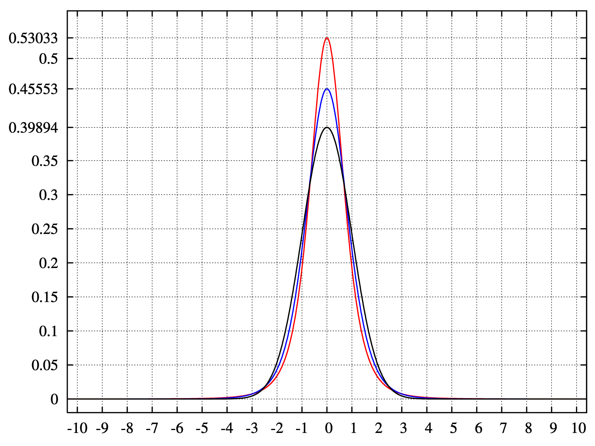

```{r echo = FALSE}
library(ggplot2)
```

# Statistics

## Expected values | Definition

The expected value of a random variable $X$, denoted $E(X)$ is a weighted average of all possible values of $X$, with weights determined by the probability density function.

The expected value is also sometimes denoted $\mu X$ or $\mu$, and called the _population mean_.

## Expected value for a discrete variable
$$
E(X) = x_1 f(x_1) + x_2 f(x_2) + ... + x_k f(x_k) \equiv \sum_{j = 1}^k x_j f(x_j)
$$
Where $x_i$ is any value taken by $X$ and $f(x)$ is the pmf of $X$

## Expected value for a continuous variable

$$
E(X) = \int_{- \infty}^\infty x f(x) dx
$$

## Example: a die

A standard die has 6 faces numbered 1 to 6. If it is fair, each face has a probability of $\frac{1}{6}$ of coming up

What is the expected value of such a die?

1 * $\frac{1}{6}$ + 2 * $\frac{1}{6}$ + 3 * $\frac{1}{6}$ + 4 * $\frac{1}{6}$ + 5 * $\frac{1}{6}$ + 6 * $\frac{1}{6}$ = 3.5


## Properties of expected values

- The expected value of a constant is the constant itself

- If for random variables $X$ and $Y$, $X \le Y$ then $E(X) \le E(Y)$

- The expected value operator is linear, in the sense:
$$
\begin{aligned}
  E[X + c] &=   E[X] + c \\
  E[X + Y] &=   E[X] + E[Y] \\
  E[aX]    &= a E[X]
\end{aligned}
$$

## Mean in R

```{r}
set.seed(356)
vec <- sample(x = 100, replace = TRUE)

mean(vec)

summary(vec)
```


## Mean in R (2)

```{r}
set.seed(356)
vec <- rnorm(100, 5, 5)

mean(vec)

summary(vec)
```

## Mean in R (3)

```{r}
set.seed(356)
vec <- rnorm(1000, 5, 5)

mean(vec)

summary(vec)
```

## Mean in R (4)

```{r}
set.seed(356)
vec <- rnorm(1000, 5, 5)
vec <- c(vec, NA)
mean(vec)
mean(vec, na.rm = TRUE)
summary(vec)
```

## Median

The median is another measure of central tendency.

For a continuous variable, the median $m$ is the value such as half of the area under the pdf is on the left of $m$.

For a discrete variable $X$, the median is defined as the middle value among the ordered values of $X$. For example, if $X$ can take values $\{4, 8, 10, 12, 13\}$ 
then the median is $10$. If $X$ takes an odd number of values, there are two medians which are sometimes averaged to get a single value.


## Measures of variability


There are two widely used measures of the variability of a random variable: the variance and standard deviation.

The variance is a measure of distance from the mean. It is defined as:

$$
Var(X) \equiv E[(X - \mu)^2]
$$
This is equivalent to $Var(X) = E(X^2) - \mu^2$. Note that variance is sometimes denoted $\sigma^2$.

The standard deviation is the positive square root of the variance:

$$
sd(X) \equiv \sqrt{Var(X)}
$$
It is sometimes denoted $\sigma$.


## Standardisation

Standardisation can be useful in numerous situations and it is a common application of the properties of variance and standard deviation.

For a random variable $X$ with mean $\mu$ and standard deviation $\sigma$, let's define:

$$
Z \equiv \frac{X - \mu}{\sigma}
$$
This new variable $Z$ will have mean $E(Z) = 0$ and standard deviation $\sigma = 1$.

This is sometimes refered to as the _z-transform_ of $X$.


## Skewness 

The skewness is defined as:

$$
E(Z^3) = E[(X - \mu)^3]/ \sigma^3
$$
In other words, it is the third standardised moment of $X$.

If skewness is 0, $X$ is symmetric around 0. If it is negative, the distribution has a longer left tail. If it is positive, it has a longer right tail.


```{r, echo = FALSE, out.width = '70%', fig.retina = NULL, fig.align = 'center'}
knitr::include_graphics('img/Negative_and_positive_skew_diagrams.png')
```

## Kurtosis

Kurtosis is defined as the fourth standardized moment of $X$:

$$
E(Z^4) = E[(X - \mu)^4] / \sigma^4
$$
Larger values of kurtosis indicate that the tail in the distribution of $X$ are thicker.


```{r, echo = FALSE, out.width = '50%', fig.retina = NULL, fig.align = 'center'}

```

## Kurtosis

A distribution with no kurtosis ($E(Z^4)= 0$) is said to be __mesokurtic__.

A distribution with positive kurtosis ($E(Z^4) > 0$) is said to be __leptokurtic__.

A distribution with negative kurtosis ($E(Z^4) < 0$) is said to be __platykurtic__.


## Moments

The expectation of a random variable is sometimes called the first moment of this variable.

The variance is the second moment. 

As we have seen, the skewness is the third moment and the kurtosis is the fourth moment of this variable.


## Quantiles

Quantiles are cutpoints dividing the range of probability distribution into intervals with equal probabilities.

```{r, echo = FALSE, out.width = '40%', fig.retina = NULL, fig.align = 'center'}
knitr::include_graphics('img/Lqr_with_quantile.png')
```

- The 4-quantiles are called quartiles

- The 10-quantiles are called deciles

- The 100-quantiles are called percentiles.


## Visualising summary statistics

There are many ways to visualise summary statistics. Two that I find very useful:

- density plot
- boxplot

## Density plot

```{r echo = TRUE, fig.align = "center", out.width = "60%"}
norm_dis <- data.frame(x = rnorm(n = 1000))
ggplot(data = norm_dis, aes(x)) + geom_density()
```

## Boxplot

```{r echo = TRUE, fig.align = "center", out.width = "60%"}
normal_dis <- data.frame(x = "Normal", y = rnorm(n = 1000, mean = 0, sd = 10))
ggplot(data = normal_dis, aes(x = x, y = y)) + geom_boxplot()
```

## Covariance

The covariance describes how two random variables relate to each other.
It is defined for random variables $X$ and $Y$ as:

$$
\newcommand{\Cov}{\operatorname{Cov}}
\newcommand{\Var}{\operatorname{Var}}
\Cov(X, Y) = (X - \mu_X)(Y - \mu_Y)
$$

It is denoted $\sigma_{XY}$ or . When $\sigma_{XY} \ge 0$, then on average, when $X$ is above (below) its mean, $Y$ is also above (below) its mean. When $\sigma_{XY} \le 0$, then on average when $X$ is above (below) its mean, $Y$ is below (above) its mean. 

## Some properties of covariance

Let $X$ and $Y$ be two random variables, and $a_1$, $a_2$ and $b_1$ and $b_2$ be constants,

$$
\newcommand{\Cov}{\operatorname{Cov}}
\newcommand{\Var}{\operatorname{Var}}
\begin{aligned}
\Cov(a_1, X) &= 0 \\
\Cov(X, Y) &= \Cov(Y, X) \\
\Cov(X, X) &= \Var(X) \\
\Cov(a_1 X, a_2 Y) &= a_1 a_2 \Cov(X, Y) \\
\Cov(X + b_1, Y + b_2) &= \Cov(X, Y)
\end{aligned}
$$

## Example of covariance

```{r, out.width = '40%', fig.retina = NULL, fig.align = 'center'}
library(ggplot2); set.seed(32)
x <- rnorm(100, mean = 1, sd = 2)
y <- 2 * x + rnorm(100, mean = 1, sd = 2)
dt <- data.frame(x = x, y = y)
ggplot(data = dt, aes(x = x, y = y)) + geom_point()
cov(x, y)
```

## Example of covariance (2)

```{r, out.width = '40%', fig.retina = NULL, fig.align = 'center'}
x <- 1:100
y <- rnorm(100, mean = 5, sd = 10)
dt <- data.frame(x = x, y = y)
ggplot(data = dt, aes(x = x, y = y)) + geom_point()
cov(x, y)
```

## Correlation

Covariance gives you information about whether two variables vary in the same or opposite direction, but does not inform you about how much they do.

The correlation coefficient, as defined by Pearson, is denoted $\rho(X, Y)$ and is equal to the covariance of X and Y divided by the product of their standard deviations:

$$
\rho(X,Y) = \frac{COV(X, Y)}{\sigma_{X} \sigma_{Y}}
$$

## Example of correlation

```{r, out.width = '40%', fig.retina = NULL, fig.align = 'center'}
x <- rnorm(100, mean = 5, sd = 10)
y <- rnorm(100, mean = 5, sd = 10)
dt <- data.frame(x = x, y = y)
ggplot(data = dt, aes(x = x, y = y)) + geom_point()

cor(x, y)
```

## Correlation test

```{r}
cor.test(x, y)
```

## Correlation examples (2)

```{r, out.width = '40%', fig.retina = NULL, fig.align = 'center'}
x <- 1:100
y <- rnorm(100, mean = 5, sd = 10)
dt <- data.frame(x = x, y = y)
ggplot(data = dt, aes(x = x, y = y)) + geom_point()
cor(x, y)
```

## Correlation examples (3)

```{r, echo = FALSE, out.width = '90%', fig.retina = NULL, fig.align = 'center'}
knitr::include_graphics('img/Correlation_examples.png')
```

## Anscombe's Quartet in R

```{r echo = TRUE}
summary(anscombe)

```

## Anscombe's Quartet in R (2)

```{r echo = TRUE}
apply(anscombe, 2, mean)
apply(anscombe, 2, sd)
```


## Anscombe's Quartet

```{r, echo = FALSE, out.width = '70%', fig.retina = NULL, fig.align = 'center'}
knitr::include_graphics("img/Anscombe's_quartet.png")
```


## Conditional expectation

The conditional expectation of a random variable, X, is another random variable equal to the expectation of X for every condition.

$$
E(X | H) = \frac{\sum_{\omega \in H} X(\omega)}{|H|}
$$

## Example

```{r echo = TRUE}
gender <- c(rep("Female", 50), rep("Male", 50))
height <- vector(mode = "numeric", length = 100)
for (i in 1:100){
  if(gender[i] == "Female"){
      height[i] <- 161.3 + rnorm(1, 0, 6)
  }else{
    height[i] <- 175 + rnorm(1, 0, 7)
  }
}
data <- data.frame(gender = gender, height = height)

```

## Example

```{r echo = TRUE}
mean(data[, "height"])

mean(data[data[, "gender"] == "Female", "height"])
```

## Example

```{r echo = TRUE, fig.align = "center", out.width = "70%"}
ggplot(data = data, aes(x = height)) + geom_density() + 
  geom_density(aes(x = height, color = gender))
```


## Conditional variance

The conditional variance of a random variable, X, is another random variable equal to the expectation of X for every condition.

```{r echo = TRUE}
sd(data[, "height"])
sd(data[data[, "gender"] == "Female", "height"])
```


# Exploring data

## Opening the Pokémon Go survey

```{r echo = TRUE}
pok <- read.csv("./data/Pokemon_Go.csv")
head(pok[, c(1, 3)])
```

Oups...

## A way around

```{r echo = TRUE}
pok_lab <- read.csv("./data/Pokemon_Go.csv", nrows = 1)

pok <- read.csv("./data/Pokemon_Go.csv", skip = 2, header = FALSE)
names(pok) <- names(pok_lab)
head(pok[, c(1, 3)])
```

## Summary statistics

Q1 asked you if you knew what Pokémon Go is.

```{r echo = TRUE}
summary(pok[, "Q1"])
```

## Q1 again

```{r echo = TRUE, fig.align = "center", out.width = "30%"}
ggplot(data = pok, aes(x = Q1)) + geom_bar() +
         scale_x_discrete(labels = c(
"Yes, I have heard of it but I have not used it although it is available in my country" = 
                                       "Yes/Available/Not used it", 
"Yes, I have heard of it but I have not used it because it is not available in my country" =
                                     "Yes/Not available", 
                                     "Yes, I have installed this game" = 
                                       "I have used it")) +
  labs(x = "", y = "Count", title = "Have you heard of Pokémon Go?")
```


## 

```{r echo = FALSE, fig.align = "center", out.width = "70%"}
ggplot(data = pok, aes(x = Q1)) + geom_bar() +
         scale_x_discrete(labels = c(
"Yes, I have heard of it but I have not used it although it is available in my country" = 
                                       "Yes/Available/Not used it", 
"Yes, I have heard of it but I have not used it because it is not available in my country" =
                                     "Yes/Not available", 
                                     "Yes, I have installed this game" = 
                                       "I have used it")) +
  labs(x = "", y = "Count", title = "Have you heard of Pokémon Go?")
```

## Gender

```{r echo = FALSE, fig.align = "center", out.width = "70%"}
ggplot(data = pok, aes(x = Q5)) + geom_bar() +
        labs(x = "", y = "Count", title = "What is your gender?")
```

## Gender and playing Pokémon Go

```{r echo = TRUE, fig.align = "center", out.width = "30%"}
ggplot(data = pok, aes(x = Q1, fill = Q5)) + 
  geom_bar(position = "dodge") +  scale_x_discrete(labels = c(
"Yes, I have heard of it but I have not used it although it is available in my country" = 
                                       "Yes/Available/Not used it", 
"Yes, I have heard of it but I have not used it because it is not available in my country" =
                                     "Yes/Not available", 
                                     "Yes, I have installed this game" = 
                                       "I have used it")) +
        labs(x = "", y = "Count", title = "Having heard of Pokémon Go by gender?")
```

## 

```{r echo = FALSE, fig.align = "center", out.width = "70%"}
ggplot(data = pok, aes(x = Q1, fill = Q5)) + 
  geom_bar(position = "dodge") +  scale_x_discrete(labels = c(
"Yes, I have heard of it but I have not used it although it is available in my country" = 
                                       "Yes/Available/Not used it", 
"Yes, I have heard of it but I have not used it because it is not available in my country" =
                                     "Yes/Not available", 
                                     "Yes, I have installed this game" = 
                                       "I have used it")) +
        labs(x = "", y = "Count", title = "Having heard of Pokémon Go by gender?")
```

# {.flexbox .vcenter}

\

